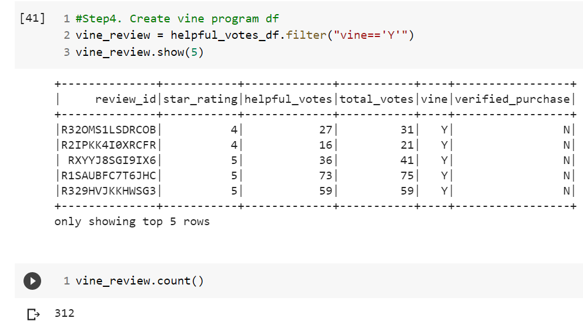
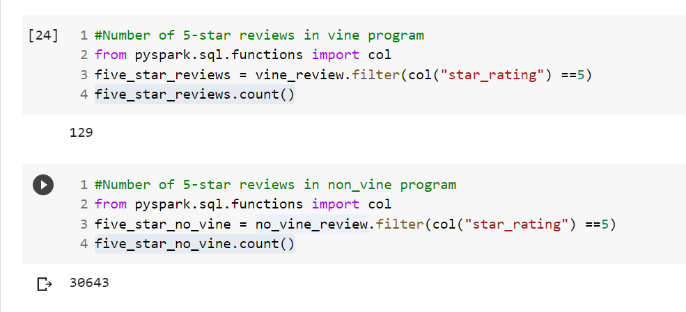

# Amazon_Vine_Analysis

## Overview of the analysis of the Vine program

The Amazon Vine program is a service that allows manufacturers and publishers to receive reviews for their products.

Therefore, the purpose of the project is support sellBy in analysing their Amazon reviews written by members of the paid Amazon Vine program. 

The dataset picked is the [sports apparel](https://s3.amazonaws.com/amazon-reviews-pds/tsv/amazon_reviews_us_Sports_v1_00.tsv.gz)
 with the objective of determining if there is any bias toward favorable reviews from Vine members in the dataset.

## Results
The transfer of data from pyspark to postgres(sql) was done to retrieve and all the four tables were populated with data. 

The screen shots below show the the sql database under the Amazon server(AWS).

- Products Table

- Customers Table

- Review Table

- Vine Table

Further, the analysis of the vine program conducted after the extraction, transformation and creation of different dataframes to visualize the results was completed. Below are the displayed results.

- Number of Vine reviews

312 total vines reviews were conducted.

- Number of Non-Vine reviews

57,608 non vine reviews were conducted out of 63,329 total reviews above the top 20 mark.

- How many Vine reviews were 5 stars?

129 five stars reviews included in the sample of 312 total vine reviews. Note the population captures only the top 2 reviews for accuracy purpose.

- 5 stars Non-Vine reviews

30,643 five stars reviews conducted on the sample of non vine population.

- Percentage of Vine and Non_Vine reviews

The percentage of five stars vine reviews was 41.3% while the non vine five stars reviews percentage was 53%.

## Summary
- From the results, non vine reviews provide a large sample and results which are considered interesting despite not having an initiaive to do so. They represent the consulers of the sports apparel products. 
  
- A new analysis on the sample to include the demography of the vine reviewers. We shall have and include a mixte of users and genders in the datasets to draw conclusion on the results of the reviews.